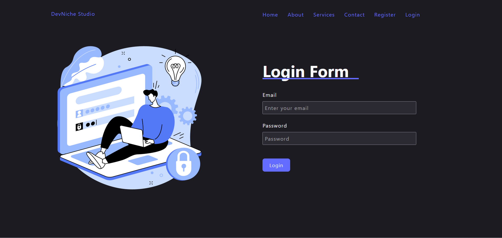

# DevNiche Studio - Backend

Welcome to the backend repository of **DevNiche Studio**! This part of the project is built with the MERN stack and handles user authentication, data management, and API endpoints.



## 🛠 Features

- **User Authentication**: Secure JWT-based authentication with bcryptjs for password hashing.
- **API Endpoints**: RESTful API for user management and other functionalities.
- **Environment Configuration**: Managed using dotenv for security and flexibility.
- **Cross-Origin Resource Sharing (CORS)**: Configured for handling cross-origin requests.

## 📦 Technologies Used

- **Express.js**: Web framework for Node.js.
- **MongoDB & Mongoose**: For database management and object modeling.
- **JWT**: For generating and validating JSON Web Tokens.
- **bcryptjs**: For hashing and comparing passwords.
- **dotenv**: For managing environment variables.
- **CORS**: For handling cross-origin requests.

## 🔗 Getting Started

### Prerequisites

Ensure you have the following installed:

- [Node.js](https://nodejs.org/) (v14 or later)
- [npm](https://www.npmjs.com/) (v6 or later)
- [MongoDB](https://www.mongodb.com/) (local or cloud instance)

### Installation

1. **Clone the repository:**

    ```bash
    git clone https://github.com/iMamoonAkhter/DevNicheStudio_Backend.git
    ```

2. **Navigate to the project directory:**

    ```bash
    cd DevNicheStudio_Backend
    ```

3. **Install dependencies:**

    ```bash
    nodemon server.js
    ```

4. **Configure environment variables:**

    Create a `.env` file in the root directory and add your environment variables:

    ```env
    PORT=5000
    MONGODB_URI=mongodb://localhost:27017/devniche
    JWT_SECRET=your_jwt_secret
    ```

5. **Run the server:**

    ```bash
    npm start
    ```

   The backend server will be available at `http://localhost:5000`.

## 📸 Screenshot

Here’s a visual representation of DevNiche Studio:


## 📝 Contributing

We welcome contributions to improve this project. If you have suggestions, bug reports, or feature requests, please open an issue or submit a pull request.

## 📧 Contact

For any inquiries or further information, feel free to connect with me on [LinkedIn](https://www.linkedin.com/in/iMamoonAkhter).

---

Thank you for exploring the backend of DevNiche Studio! 🎉

#DevNicheStudio #MERNStack #NodeJS #ExpressJS #MongoDB #JWT #OpenSource
